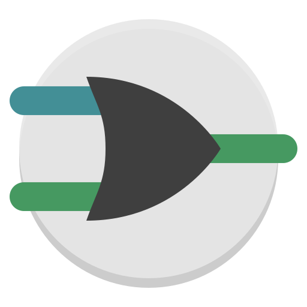

<!-- Prism CSS (use an actual theme file) -->
<!-- <link rel="stylesheet" href="https://cdn.jsdelivr.net/npm/prismjs/themes/prism-tomorrow.min.css"> -->

# Hi there 🦧

## I'm manak

---

<!-- ```c
// struct human
struct Human *manak = &(struct Human)
{
    "manak",
    "loves to code",
    "data structures and algorithms",
    "backend development",
    "machine learning"
};


// intrest struct
struct Intrests *intrests = &(struct Intrests)
{
  "Data Structures And Algorithms",
  "Backend Development",
  "Machine Learning"
};
``` -->

<!-- ```c
// define human struct
struct Human manak = {
    "manak",
    "loves to code",
};

// define interests struct
struct Interests dev_life = {
    "Data Structures And Algorithms",
    "Backend Development",
    "Machine Learning"
};

// define daily routine method
void build_life(struct Human *human, struct Interests *intrests)
{
    human->code();
    human->build_code(interests);
    human->break_code(interests);
    human->test_code(interests);
    human->ship_code();
}
``` -->

```json
{
  name: "manak,
  interests: 
  {
      "Data Structures And Algorithms",
      "Full Stack Development",
      "Machine Learning"
  }
}
```

---

## 🏗️ Things I’ve Built (to stay sane or lose it)

explore the chaos → [all projects](https://github.com/manakcodes/code-brew/blob/main/README.md)

---

## 🛠️ Tech Stack

### 💻 Tools of the Trade (and Occasional Chaos)

#### 🧬 Languages

<p align="left">
  
  
  
  
  
</p>

#### 🧃 Frameworks / Libraries

<p align="left">
  
  
  
</p>

#### 🛢️ Databases

<p align="left">
  
  
  
  
</p>

#### 🕸️ Web

<p align="left">
  
  
</p>

#### ⚙️ Tools / Version Control

<p align="left">
  
  
  
</p>

#### 🧪 Scientific

<p align="left">



</p>

### 🛝 IDEs & Editors


---

<!--

---

### ❤️‍🔥 Tech Stack – Love/Hate Edition

* **C**
  *+* Fast, lean, and close to the metal.
  *−* Also close to insanity and undefined behavior.

* **C++**
  *+* Powerful enough to build anything.
  *−* Complicated enough to make you forget what you were building.

* **Java**
  *+* Reliable, scalable, enterprise-grade.
  *−* Verbose enough to age you 10 years per class.

* **Python**
  *+* Clean syntax, endless libraries, ML’s best friend.
  *−* Slower than your motivation on a Monday.

* **HTML**
  *+* The skeleton of the web.
  *−* Still not a programming language, sorry.

* **CSS**
  *+* Can make anything look beautiful.
  *−* Also capable of ruining your weekend with a missing semicolon.

* **JavaScript**
  *+* Runs everywhere, does everything.
  *−* Also does things you never asked it to.

* **SQL**
  *+* Precise, powerful, and speaks to your data.
  *−* One typo and you’re querying your way into oblivion.

* **SQLite3**
  *+* Lightweight and easy to embed.
  *−* Great until you realize your database is just a file.

* **PostgreSQL**
  *+* Rock-solid and feature-rich.
  *−* Will gaslight you with cryptic error messages.

* **Django**
  *+* Comes with everything out of the box.
  *−* Debugging feels like navigating IKEA with no map.

* **Git**
  *+* Version control that saved coding.
  *−* Until you do `git reset --hard` and lose your soul.

* **VS Code**
  *+* Slick UI, great extensions, dev darling.
  *−* Sometimes acts like it’s built in JavaScript (because it is).

* **Stack Overflow**
  *+* The silent mentor we all need.
  *−* Half the answers are from 2012 and still better than yours.

---

-->

<!--
**manakcodes/manakcodes** is a ✨ _special_ ✨ repository because its `README.md` (this file) appears on your GitHub profile.

Here are some ideas to get you started:

- 🔭 I’m currently working on ...
- 🌱 I’m currently learning ...
- 👯 I’m looking to collaborate on ...
- 🤔 I’m looking for help with ...
- 💬 Ask me about ...
- 📫 How to reach me: ...
- 😄 Pronouns: ...
- ⚡ Fun fact: ...
-->

<!--
**manakcodes/manakcodes** is a ✨ _special_ ✨ repository because its `README.md` (this file) appears on your GitHub profile.

Here are some ideas to get you started:

- 🔭 I’m currently working on ...
- 🌱 I’m currently learning ...
- 👯 I’m looking to collaborate on ...
- 🤔 I’m looking for help with ...
- 💬 Ask me about ...
- 📫 How to reach me: ...
- 😄 Pronouns: ...
- ⚡ Fun fact: ...
-->
